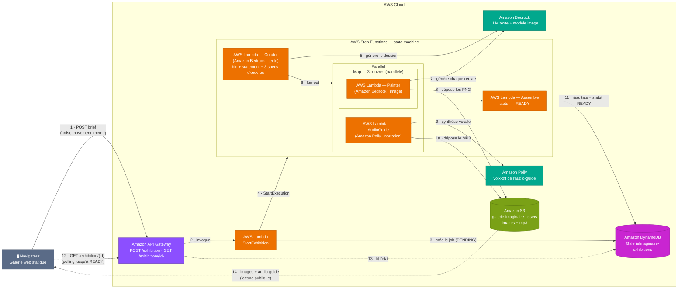

# Galerie Imaginaire — Architecture

Application **serverless** de génération d'expositions virtuelles propulsée par
l'IA générative. Le visiteur invente un·e artiste (nom, mouvement, thème) et la
plateforme produit, en moins d'une minute, une exposition complète : un dossier
curatorial (texte), trois œuvres illustrées (images) et un audio-guide (audio).

Services principaux : **Amazon API Gateway · AWS Lambda · AWS Step Functions ·
Amazon Bedrock · Amazon Polly · Amazon DynamoDB · Amazon S3**.

---

## Diagramme d'architecture (workflow)

---

## Déroulé du workflow

### Flux d'envoi — création de l'exposition
1. **Navigateur → API Gateway** : envoi du brief (`artist`, `movement`, `theme`) via `POST /exhibition`.
2. **API Gateway → Lambda StartExhibition** : la requête déclenche la fonction d'entrée.
3. **StartExhibition → DynamoDB** : création de l'enregistrement du job avec le statut `PENDING`.
4. **StartExhibition → Step Functions** : démarrage de l'exécution de la state machine (`StartExecution`).
5. **Curator → Bedrock** : génération du **dossier curatorial** (biographie, *curatorial statement*, et 3 specs d'œuvres `{title, wall_label, image_prompt}`) sous forme de JSON structuré.
6. **Curator → Parallel** : *fan-out* vers les deux branches parallèles.
7. **Painter → Bedrock** : pour chacune des 3 œuvres (état **Map**, en parallèle), génération de l'image dans le style du mouvement choisi.
8. **Painter → S3** : dépôt des 3 fichiers PNG.
9. **AudioGuide → Polly** : synthèse de la narration de l'audio-guide à partir de la bio et du statement.
10. **AudioGuide → S3** : dépôt du fichier MP3.
11. **Assemble → DynamoDB** : assemblage des résultats (URLs images + audio, textes) et passage du statut à `READY`.

### Flux de récupération — visite de la galerie
12. **Navigateur → API Gateway** : `GET /exhibition/{id}` en *polling* jusqu'à ce que le statut soit `READY`.
13. **API Gateway → DynamoDB** : lecture de l'état et des résultats de l'exposition.
14. **S3 → Navigateur** : chargement des œuvres et de l'audio-guide (lecture publique) pour afficher la galerie.

---

## Légende des couleurs (catégories AWS)

| Couleur | Catégorie | Services |
|---|---|---|
| 🟣 Violet | Networking & Content Delivery | Amazon API Gateway |
| 🟠 Orange | Compute | AWS Lambda |
| 🩷 Rose | Application Integration | AWS Step Functions |
| 🟢 Vert d'eau | Machine Learning / AI | Amazon Bedrock, Amazon Polly |
| 🟪 Magenta | Database | Amazon DynamoDB |
| 🟩 Vert | Storage | Amazon S3 |
| ⚪ Gris | Client | Navigateur (galerie web statique) |

> Les flèches **pleines** représentent le flux de **création** de l'exposition (étapes 1→11).
> Les flèches **pointillées** représentent le flux de **récupération / visite** (étapes 12→14).
