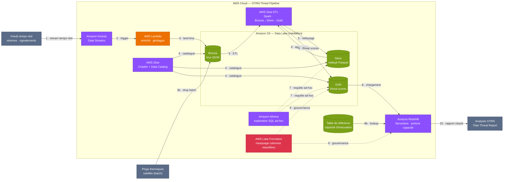

# Lab 4 — Operation Kaiju Watch · Architecture

Pipeline de données **serverless** pour la détection de menaces Titan.
Fusionne trois flux de données (séismes, thermique satellite, signalements civils)
avec une table de référence (capacité d'évacuation) pour produire un **Titan Threat Report**
classant les zones côtières par niveau de menace.

Services principaux : **Amazon Kinesis · AWS Lambda · Amazon S3 · AWS Glue ·
Amazon Athena · Amazon Redshift · AWS Lake Formation**.

---

## Diagramme d'architecture

---

## Correspondance flux → domaine d'examen DEA-C01

| # | Étape | Services | Domaine DEA-C01 |
|---|-------|----------|-----------------|
| 1–3 | Ingestion temps réel + batch, enrichissement, atterrissage brut | **Kinesis · Lambda · S3** | Ingestion & Transformation (34 %) |
| 4–6 | Crawl, catalogue, ETL Bronze → Silver → Gold | **Glue (Crawler + ETL)** | Transformation + Data Store (26 %) |
| 7 | Exploration SQL ad-hoc sur le lac | **Athena** | Operations & Support (22 %) |
| 8 | Warehouse + jointure capacité → rapport classé | **Redshift** | Data Store Management (26 %) |
| 9 | Masquage des colonnes classifiées (militaire) | **Lake Formation** | Security & Governance (18 %) |
| 10 | Titan Threat Report (classement d'évacuation) | SQL output | Le livrable final |

---

## Légende des couleurs

| Couleur | Catégorie | Services |
|---|---|---|
| 🟣 Violet | Analytics | Kinesis, Glue, Athena, Redshift |
| 🟠 Orange | Compute | Lambda |
| 🟩 Vert | Storage | S3 |
| 🔴 Rouge | Security & Governance | Lake Formation |
| ⚪ Gris | Client / externe | Capteurs, satellite, analyste |
